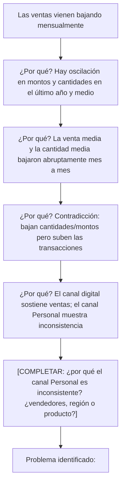

# Análisis de la Gestión Comercial de AdventureWorks

Análisis de causa raíz sobre la caída en las ventas de AdventureWorks, 
realizado a partir de un requerimiento gerencial: identificar en qué canal, 
región o categoría de producto se concentra la baja, y recomendar una 
decisión estratégica para revertirla.

## Contexto / El problema

Al revisar el cierre acumulado del período, la Dirección Comercial detectó 
una variación mensual negativa (-2,76%) y fuertes oscilaciones en la 
facturación total. Antes de recortar presupuestos, se solicitó un Análisis 
de Causa Raíz para entender dónde se estaba perdiendo valor y qué acciones 
inmediatas tomar.

## Objetivos

Trabajando sobre el modelo relacional en Power BI, se resolvieron los 
siguientes puntos:

1. **Identificación de canales**: separar el negocio entre la fuerza de 
   ventas física (canal Personal) y el canal digital/web, para determinar 
   cuál está impactando negativamente.
2. **Estadística descriptiva y KPIs**: calcular el Ticket Promedio y la 
   Cantidad de Productos por Pedido, para evaluar la eficiencia de la fuerza 
   de ventas y el comportamiento del cliente.
3. **Análisis de causa raíz (geográfico y de producto)**: determinar en qué 
   regiones y subcategorías específicas se concentra el problema.

## Herramientas utilizadas
- SQL Server (extracción y transformación de datos)
- Power BI Desktop (modelado y visualización)
- Metodología de los 5 Por qué (Root Cause Analysis)

## Estructura del análisis
- **Consultas SQL**: extracción de ventas, productos, categorías, personas 
  y territorios desde la base AdventureWorks (`Consultas_SQL.sql`).
- **Dashboard**: KPIs de ventas, evolución mensual por canal, distribución 
  por categoría y por región.
- **Análisis de causa raíz**: cadena de "5 Por qué" para llegar a la causa 
  específica de la caída.
- **Recomendación estratégica**: decisión de negocio basada en los hallazgos.

## Consultas SQL
Las consultas utilizadas para extraer y transformar los datos están en 
este repositorio: `Consultas_SQL.sql`. Incluyen la extracción de ventas por 
pedido, catálogo de productos y categorías, datos de vendedores/clientes y 
territorios de venta.

## Dashboard

Principales KPIs relevados: Ventas totales, Variación mensual, 
Transacciones, Ticket Medio, Cantidad Media, Vendedores. El dashboard 
permite filtrar por canal (Digital / Personal), categoría de producto y 
región.

## Análisis de Causa Raíz (5 Por qué)

## Recomendación estratégica

**¿El problema es de los vendedores, de la región o de los productos?**

**¿Qué decisión debería tomar la gerencia con el presupuesto del próximo año?**

